# 02 - User Stories (Business level, no tech)

Actors used across diagrams:
- **Player** — the end user playing/browsing
- **Frontend** — Angular SPA
- **Backend** — Spring Boot API
- **Data** — the book JSON files / persisted game data

Stories are grouped in the suggested delivery order (mirrors the 4-hour exercise
objectives). Stories marked **🆕 Proposed addition** were not in the original list you
gave me — I think they're implied by the brief and worth tracking explicitly, but feel
free to drop/merge them.

---

## US-01 — Validate books at startup

**As a** system (no user interaction)
**I want to** validate every book file when the application starts
**So that** only well-formed, playable books are ever offered to players

### Description
Runs automatically when the backend boots (or on first load of the book catalog).
Applies the four invalidity rules from the brief. Invalid books are excluded from what
players can see/play, but the reason should be recorded/loggable for diagnosis.

### Acceptance Criteria
- Given a book file with none, or more than one, `BEGIN` section, it is marked invalid.
- Given a book file with no `END` section, it is marked invalid.
- Given a book file where any option's `gotoId` does not match an existing section id,
  it is marked invalid.
- Given a book file with a non-`END` section that has no `options`, it is marked invalid.
- Given a book file that is empty or not parseable JSON (e.g. `dragon-quest.json`), it is
  marked invalid without crashing startup.
- Valid books are loaded and made available to the catalog; invalid ones are excluded
  and the specific failing rule(s) are logged/recorded per book.
- Adding/removing a book file and restarting re-runs validation (no stale state).

### Sequence Diagram
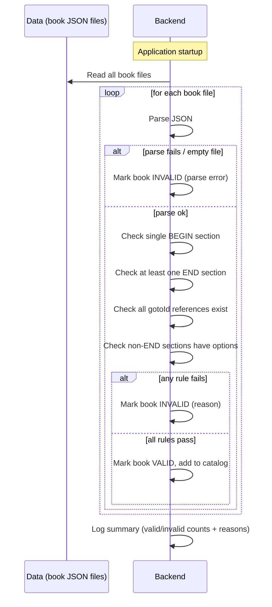

---

## US-02 — Home page presenting the game

**As a** Player
**I want to** land on a welcoming home page that explains what the app is
**So that** I understand the concept before picking a book

### Description
The hero/banner area from the mockup ("Adventure Awaits" + short pitch + count of
available adventures). This is presentational — the actual library/search grid is
covered by US-03.

### Acceptance Criteria
- Given I open the application, I see a title, a short description of the concept, and
  the number of available (valid) adventures.
- The home page does not require login/auth to view.
- The count of "available adventures" reflects only valid books (per US-01), not the
  total file count.

### Sequence Diagram
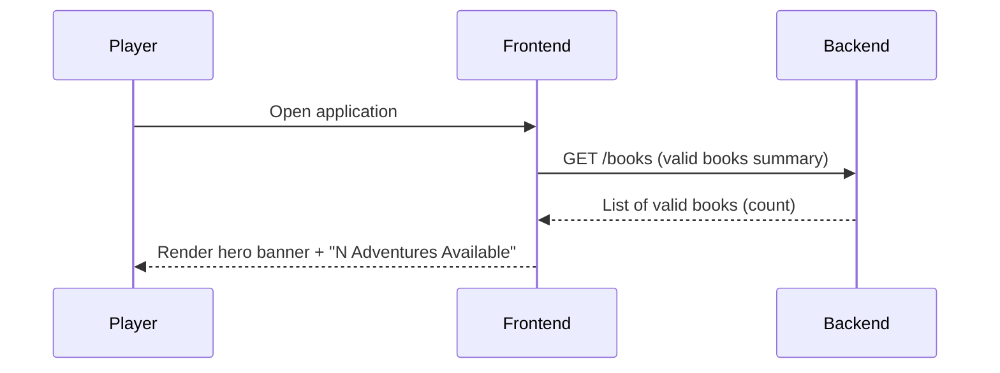

---

## US-03 — Browse the book library (search & filter, valid books only)

**As a** Player
**I want to** see all valid books and search/filter them (by name, difficulty, tags)
**So that** I can quickly find a book that interests me

### Description
Covers the library grid under the hero banner: book cards, free-text search, and filter
pills (difficulty, genre/theme tags).

### Acceptance Criteria
- Given invalid books exist, they never appear in the library listing.
- Given I type in the search box, the list narrows to books whose title/author/
  description/tags match the text (case-insensitive).
- Given I select one or more filter pills (e.g. difficulty = Easy), only matching books
  are shown.
- Given search and filters are combined, results satisfy both.
- Given no book matches, I see a clear "no results" state instead of a blank/broken page.
- Each book card shows at minimum: title, author, short description, difficulty, tags,
  and a call-to-action to begin.

### Sequence Diagram
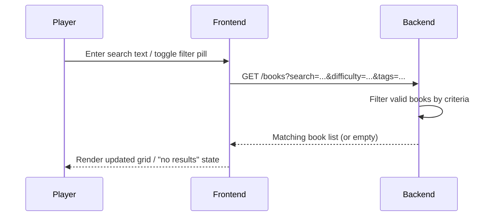

---

## US-04 — Select a book and enter the game

**As a** Player
**I want to** pick a book from the library and start reading it
**So that** I can begin my adventure

### Acceptance Criteria
- Given I click "Begin Quest" on a book card, I am taken to the game screen for that
  book, positioned at its `BEGIN` section.
- Given the chosen book somehow becomes invalid/unavailable between listing and
  selection (e.g. race condition), I see an error instead of a broken game screen.
- The game screen header shows the book's name.

### Sequence Diagram
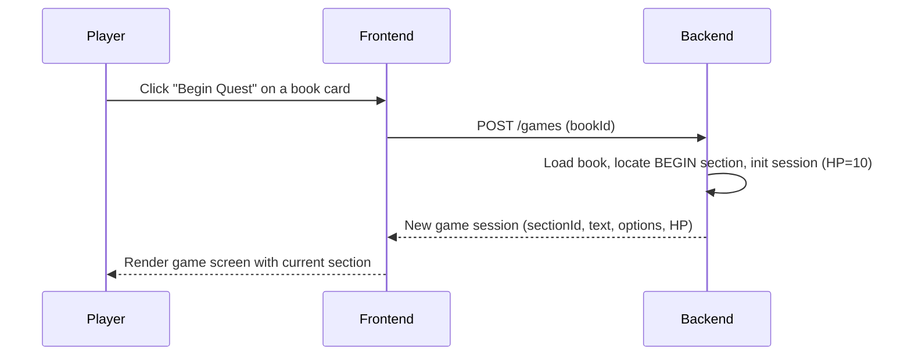

---

## US-05 — Start a game and execute basic interactions (no consequences yet)

**As a** Player
**I want to** read the current section's text and choose one of the listed options
**So that** I can progress through the story

### Acceptance Criteria
- Given I'm on a `NODE` section, I see its text and all of its options as selectable
  choices.
- Given I choose an option, the game moves to the section referenced by its `gotoId`.
- Given the target section is an `END` section, the game shows an ending state (see
  US-07) instead of more options.
- No health/consequence effects are applied yet at this stage (deferred to US-06).
- Given I try to act on a stale/already-finished game session, the app prevents further
  moves and tells me the game has ended.

### Sequence Diagram
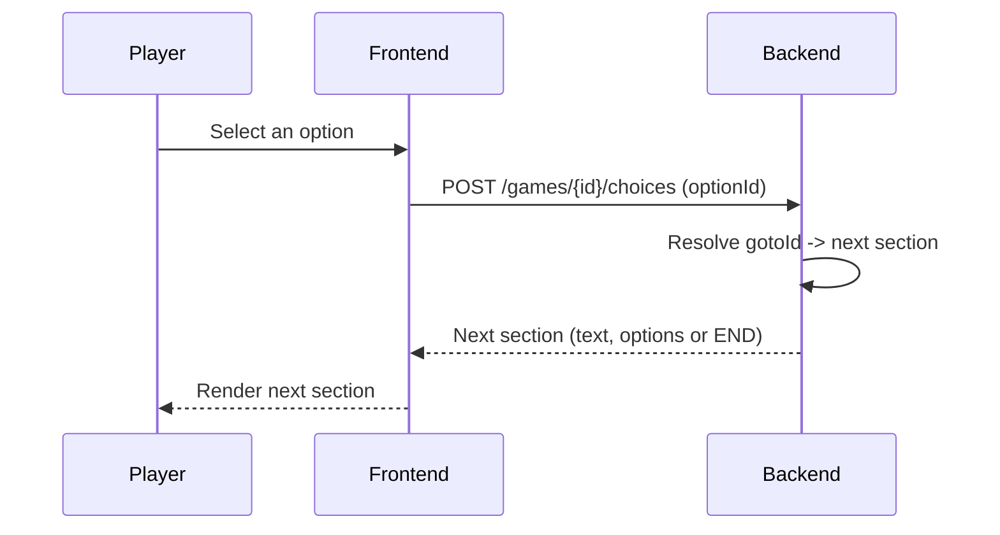

---

## US-06 — Suffer consequences and manage health

**As a** Player
**I want to** see my health change when a choice has a consequence
**So that** I feel the risk/reward of my decisions

### Acceptance Criteria
- Given an option carries a `LOSE_HEALTH` consequence, choosing it reduces my HP by the
  specified value and I'm shown the consequence text.
- Given my HP reaches 0, the game ends in death (distinct from reaching a normal `END`
  section) — see US-07.
- HP is visible at all times in the header while playing.
- HP never goes below 0 (clamped at 0 on death). The brief only defines 10 as the
  *starting* value — it does not state a hard maximum, so healing/overflow behavior
  (if any consequence ever restores HP) is an open design decision, not an assumed cap.
- The backend is the source of truth for HP (frontend cannot be trusted to self-report
  health), so a malicious/buggy client can't bypass consequences.

### Sequence Diagram
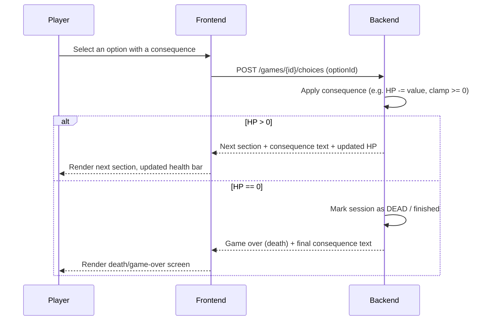

---

## US-07 — 🆕 Proposed addition: Reach an ending (win) or die (game over)

**As a** Player
**I want to** get a clear end-of-game screen, whether I finished the story or died
**So that** I know the outcome and can return to the library

### Description
The brief explicitly separates "book has an ending" from "player dies at 0 HP" as two
different end states. Both need a dedicated UI resolution, not just "no more options".

### Acceptance Criteria
- Given I reach an `END` section with HP > 0, I see a "The End" style screen with the
  final section's text, clearly distinguished from a death.
- Given my HP hits 0, I see a "You died" style screen, distinguished from a normal
  ending, including which choice caused it.
- From either end screen, I can return to the library (and, once US-09/US-10 exist,
  optionally start over or view saved games).
- A finished session (won or dead) cannot be used to make further choices.

### Sequence Diagram
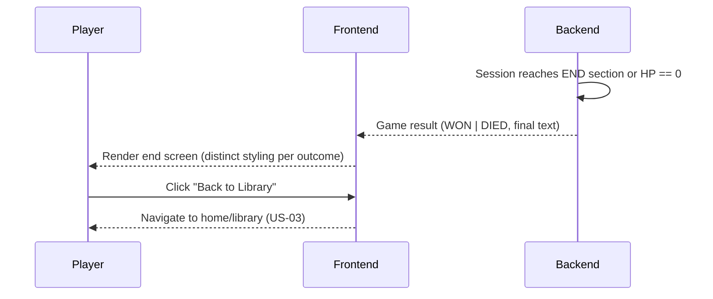

---

## US-08 — 🆕 Proposed addition: Stop a game session (header control)

**As a** Player
**I want to** stop a game in progress via the header control
**So that** I'm not forced to finish in one sitting

### Description
The brief requires the header to allow "stop/pause the game." We decided **not to
design "pause" as a separate mechanic** — this isn't real-time gameplay (nothing
advances without a player choice), so there's no state to actively "pause." We're
deliberately sequencing this after Save:

1. **First pass (before US-09 exists):** "Stop" simply navigates back to the library.
   No confirmation, no persistence — progress is lost, same as just closing the tab.
2. **Revisit after US-09 (Save) is implemented:** once saving exists, change "Stop" to
   check for unsaved progress and prompt the player to save before leaving. At that
   point confirm whether a separate "Pause" is still wanted, or if "Stop" (with an
   optional save prompt) fully covers the requirement.

Do not build confirmation/unsaved-progress logic as part of this story — that behavior
belongs to the revisit pass once US-09 is done.

### Acceptance Criteria (first pass, pre-Save)
- Given I click "Stop" in the header while playing, I'm immediately returned to the
  library.
- Given I stop a game, the in-progress session is abandoned (no persistence yet).
- Stopping does not apply any consequence by itself (it's a neutral action).

### Acceptance Criteria (revisit pass, post-Save — not yet built)
- Given I have unsaved progress and click "Stop," I'm prompted to save first.
- Given I confirm without saving, progress is lost as before.
- Given I save then stop, I can later resume via US-10.

### Sequence Diagram
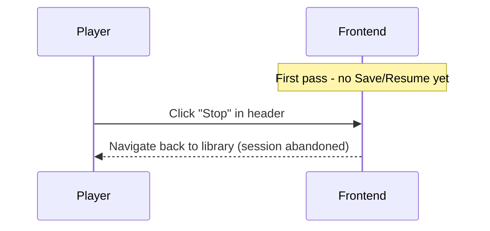

---

## US-09 — Save progress (extra, Objective 4)

**As a** Player
**I want to** save my current section, HP, and choices-so-far for a book
**So that** I can continue later instead of restarting from the beginning

### Acceptance Criteria
- Given I click "Save Progress" in the header during a game, my current session state
  (book, section id, HP) is persisted.
- Given I save twice for the same book, the newer save supersedes the previous one (one
  active save per book per player, unless multiple save slots are explicitly desired).
- Given a save fails (e.g. backend unavailable), I get a clear error, not a silent
  failure.

### Sequence Diagram
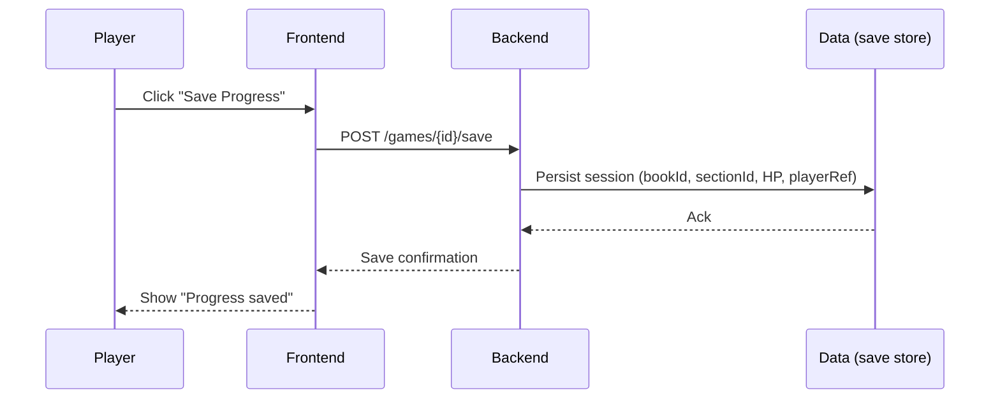

---

## US-10 — 🆕 Proposed addition: Resume a saved game

**As a** Player
**I want to** see my saved games and resume one from where I left off
**So that** saving (US-09) is actually useful

### Acceptance Criteria
- Given I have one or more saved games, I can see them (e.g. on the home page or a
  "Continue" section) with book title, last section reached, and HP at save time.
- Given I resume a saved game, I'm placed back at the saved section with the saved HP,
  not restarted from `BEGIN`.
- Given the underlying book changed or became invalid since the save was made, I get a
  clear error rather than a broken session.

### Sequence Diagram
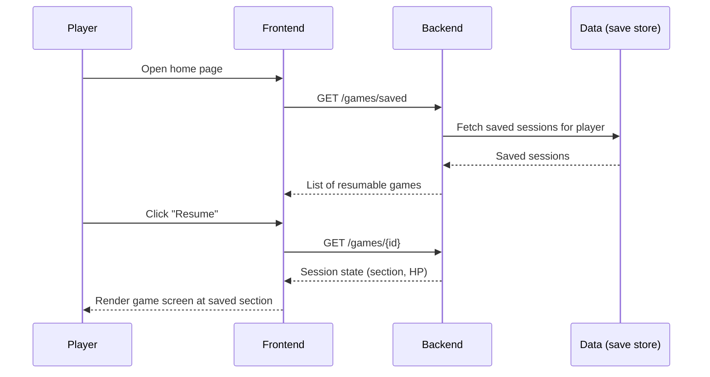

---

## US-11 — Add a new book (extra, Objective 5)

**As a** Player (or content contributor)
**I want to** add a new book to the library
**So that** I can play custom/new stories without a developer redeploying the app

### Description
Implementation approach is open (per the brief), but whatever UI/flow is chosen must
reuse the same validation from US-01 — an invalid uploaded book must not silently
corrupt the library or crash the app.

### Acceptance Criteria
- Given I submit a new book (e.g. upload JSON, or paste/author it), it is run through
  the same validation rules as startup (US-01) before being accepted.
- Given the submitted book is invalid, I see which rule(s) it failed, and it is not
  added to the library.
- Given the submitted book is valid, it immediately appears in the library (US-03)
  without needing an app restart.
- Duplicate titles/ids are handled predictably (e.g. rejected or versioned, not silently
  overwritten without warning).

### Sequence Diagram
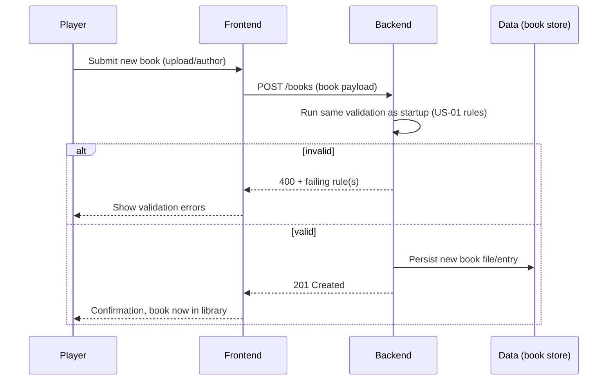

---

## Summary table

| # | Story | Objective | Status |
|---|---|---|---|
| US-01 | Validate books at startup | 1 (prerequisite) | from your list |
| US-02 | Home page presenting the game | 1 | from your list |
| US-03 | Browse library (search & filter) | 1 | from your list |
| US-04 | Select a book & enter the game | 1→2 | from your list |
| US-05 | Basic interactions, no consequences | 2 | from your list |
| US-06 | Consequences & health | 3 | from your list |
| US-07 | Reach ending (win) or die | 3 | 🆕 proposed |
| US-08 | Stop a game (first pass pre-Save; revisit post-Save) | 3→4 (header requirement) | 🆕 proposed |
| US-09 | Save progress | 4 (extra) | from your list |
| US-10 | Resume a saved game | 4 (extra) | 🆕 proposed |
| US-11 | Add a new book | 5 (extra) | from your list |

Open question for you: do you want **US-07/08/10** kept as separate stories, or folded
back into US-06/US-09 as extra acceptance criteria? I kept them separate since they each
have distinct UI states and are easy to lose track of otherwise, but happy to merge.
