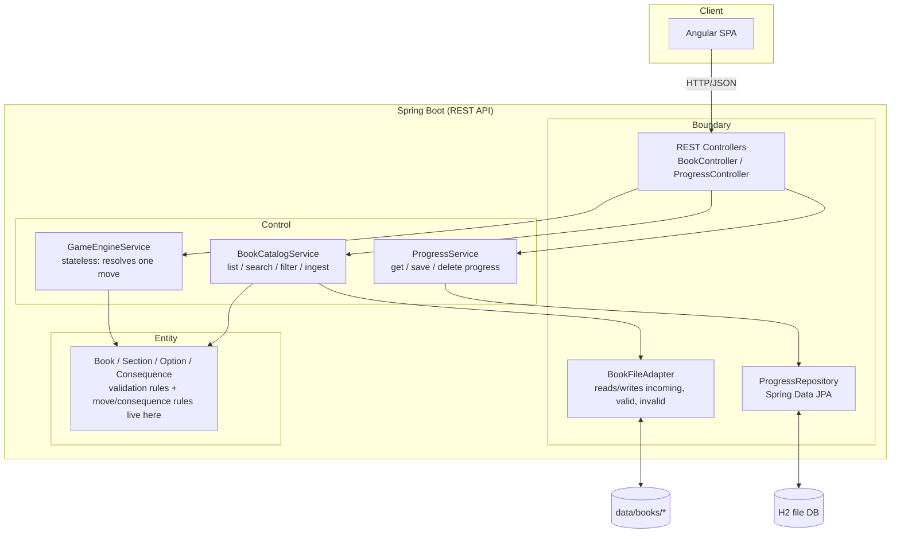
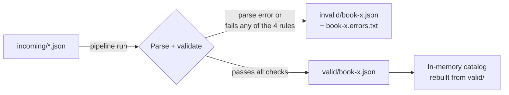
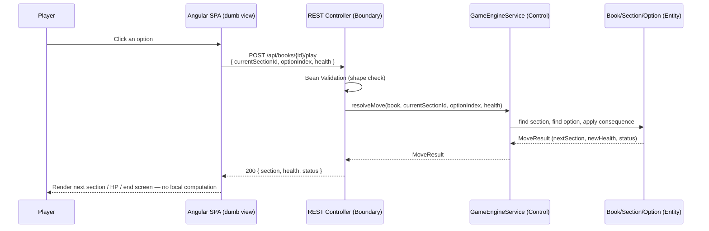

# 03 - Technical Architecture

This covers the **technical** stack only. Business/domain architecture (bounded
contexts, state machine, API-to-user-story mapping) follows in `04-business-architecture.md`.

## Stack decisions

| Layer | Choice | Version | Why |
|---|---|---|---|
| Language | Java | 21 (LTS) | Required by the brief; already installed; LTS baseline for Spring Boot 4. |
| Backend framework | Spring Boot | **4.1.1** (Spring Framework 7.x) | Latest stable (confirmed on Maven Central, not a milestone/RC). Chosen deliberately over the safer 3.x line per your call — latest-and-greatest over battle-tested. |
| Build tool | Maven | 3.9.x (already installed) | Required by the brief. |
| Frontend framework | Angular | **22.2.1** | Latest stable (confirmed via npm registry `dist-tags.latest`). Matches installed Node 26.5.0 (`^26.0.0` is a supported Angular 22 engine range). |
| Frontend runtime | Node.js | 26.5.0 (already installed) | Satisfies Angular 22.x engine requirements. |
| Frontend styling | Plain SCSS | Angular CLI default | No UI framework (no Tailwind/Material) — full control to match the provided mockups pixel-for-pixel, matches your prior approach. |
| Frontend unit tests | Vitest | Angular CLI 22 default | Default test runner scaffolded by `ng new` in this Angular version — no reason to swap it out. |
| Persistence — book catalog | **Flat-file pipeline** (no DB) | n/a | See "Book ingestion pipeline" below. |
| Persistence — saved games | **H2, file-based** (embedded) | latest compatible with Spring Boot 4.1.1 (managed by Spring Boot BOM, not pinned manually) | Structured/queryable, survives restarts (unlike in-memory H2), zero external infra to install — appropriate for a timeboxed exercise. |

## Architecture pattern: DDD-lite + ECB (Entity-Control-Boundary)

We're not doing full hexagonal/ports-and-adapters ceremony — just enough separation to
keep domain rules (book validity, game/consequence rules) independent of HTTP and
persistence concerns (DDD-lite), organized using the three classic ECB stereotypes:

- **Boundary** — anything touching the outside world: REST controllers (HTTP in),
  the book-file adapter (filesystem in), the progress repository (H2 out).
- **Control** — stateless orchestrators that coordinate a use case using one or more
  Entities, with no business rules of their own (e.g. "load the book, ask the Entity to
  validate it, ask the Entity to resolve the move, hand the repository the result").
- **Entity** — the domain model itself (`Book`, `Section`, `Option`, `Consequence`) and
  the business rules that must always hold true regardless of caller: the 4 book-validity
  rules, applying a consequence, clamping HP, deciding win/death.



## Core principle: backend is the source of truth, frontend is "dumb"

- The backend owns **all** game rules: book validity, move resolution, consequence
  application, HP clamping, win/death decisions. It never trusts client-supplied game
  state as authoritative truth for what *should* happen — only as *input* to decide
  the next official state.
- The frontend's job is strictly **display + capture input**: render whatever the
  backend returns (section text, options, HP, status), send the player's choice back,
  and render the next response. It must not re-implement or duplicate any rule
  (no client-side HP math, no client-side validity checks, no client-side win/death
  detection) — if the UI ever needs to show something new, that's a sign the backend
  response needs an extra field, not that the frontend should start computing it.
- Practical effect on the API: every response the backend sends is a complete,
  ready-to-render view model (see `MoveResult`/API contract below) — the frontend
  never has to combine multiple pieces of local state to figure out what to show.

## Backend module layout (Maven, single module, packages mirror ECB)

```
backend/
├── pom.xml
├── data/
│   └── books/
│       ├── incoming/   <- drop new book JSON files here
│       ├── valid/      <- books that passed all 4 validity rules
│       └── invalid/    <- rejected books + "<filename>.errors.txt"
│   └── db/             <- H2 file-based database files (gitignored)
└── src/
    ├── main/java/com/adventurebook/
    │   ├── AdventureBookApplication.java
    │   ├── boundary/
    │   │   ├── rest/           # BookController, ProgressController + request/response DTOs
    │   │   └── file/           # BookFileAdapter (filesystem pipeline), ProgressRepository (JPA)
    │   ├── control/            # BookCatalogService, GameEngineService, ProgressService
    │   ├── entity/             # Book, Section, Option, Consequence, Difficulty, SectionType + domain rules
    │   └── common/             # GlobalExceptionHandler, shared error DTOs, logging config
    └── test/java/com/adventurebook/...
```

Rationale: `entity` (domain model + validation/game rules) is pure and framework-free —
easy to unit test exhaustively against the 4 invalidity rules and the sample files
(including the empty `dragon-quest.json` and the invalid `the-prisoner.json`).
`control` depends on `entity` but has no HTTP/persistence code of its own, so game-move
logic is testable without spinning up Spring MVC. `boundary` is the only layer allowed
to touch Spring Web annotations, the filesystem, or JPA — keeps Objective 1-3 work
(stateless, no DB) decoupled from Objective 4 (save, the only thing touching H2).

## Domain model (Entity layer — based on the provided book JSON format)

```
Book
 ├─ title: String
 ├─ author: String
 ├─ difficulty: Difficulty (EASY | MEDIUM | HARD)
 └─ sections: List<Section>
      validate(): List<ValidationError>   // the 4 invalidity rules, returns ALL failures, not just the first

Section
 ├─ id: String            // normalized to String at parse time — sample data mixes numeric (1) and string ("500") ids
 ├─ text: String
 ├─ type: SectionType (BEGIN | NODE | END)
 └─ options: List<Option>  // empty/absent allowed only when type == END

Option
 ├─ description: String
 ├─ gotoId: String          // must reference an existing Section.id
 └─ consequence: Consequence | null

Consequence
 ├─ type: ConsequenceType   // LOSE_HEALTH today; enum left open for more types later
 ├─ value: int              // parsed from the JSON's string value
 └─ text: String            // flavor text shown to the player when it triggers

Difficulty = EASY | MEDIUM | HARD
SectionType = BEGIN | NODE | END
```

Domain behavior lives on these classes, not in services, e.g.:
- `Book.validate()` → runs all 4 rules, collects every failure (feeds the
  `.errors.txt` content 1:1).
- `Section.isEnding()` → `type == END`.
- `Consequence.applyTo(int health)` → returns the clamped-at-0 new health.
- A small `MoveResult` value object (`section`, `health`, `status`, `consequenceText`)
  is returned by the
  domain move logic and reused as-is for the API response shape below.

## Book ingestion & validation pipeline

Implements **US-01** (validate at startup) and backs **US-11** (add a new book) with the
same mechanism — "adding a book" is just "drop a file in `incoming/` and run the
pipeline."



- **Trigger**: runs once automatically on backend startup (`ApplicationRunner`), and can
  be re-triggered on demand (e.g. `POST /api/books/ingest`) so US-11 doesn't require a
  restart.
- **Idempotent**: files already in `valid/`/`invalid/` are not re-validated unless a new
  file with the same name lands in `incoming/` again (simplest correct behavior for a
  4-hour build; revisit only if it becomes a problem).
- **Error reporting**: `invalid/<name>.errors.txt` lists every failed rule in
  plain English (not just the first one) — e.g.:
  ```
  FAILED: no BEGIN section found
  FAILED: option at section 666 is a NODE with no options
  ```
- **Catalog**: the in-memory list the API serves (`GET /api/books`, search/filter) is
  built by reading `valid/*.json` — no DB table duplicates book content. Rebuilt whenever
  the pipeline runs.

## Saved game persistence (H2, file-based)

- Spring Data JPA + H2 file database (e.g. `jdbc:h2:file:./data/db/adventurebook`), so
  data survives restarts, no external DB server needed.
- One table is enough for both "live session" and "saved game" concepts — a session row
  always exists while playing; `POST /games/{id}/save` just persists/updates it
  explicitly (vs. only existing in server memory). Exact schema/entities are a business
  concern, detailed in `04-business-architecture.md`.
- Book *content* is never stored in H2 — only references (e.g. `bookId`/filename) plus
  the player's current position (`sectionId`), HP, and status (`IN_PROGRESS` / `WON` /
  `DIED`). This avoids data duplication and staleness if a book file changes.

## API contract

| Method | Route | Input | Output |
|---|---|---|---|
| `GET` | `/api/books` | query params: `search`, `difficulty`, `tags` (all optional) | Summarized list of **valid** books (id, title, author, difficulty, tags, description) |
| `GET` | `/api/books/{id}` | — | Full detail of a valid book (all sections) — used to render the home → "book detail"/"begin quest" step |
| `POST` | `/api/books/{id}/play` | `{ currentSectionId, optionIndex, health }` (omit `currentSectionId`/`optionIndex` to start a fresh game at `BEGIN`) | `{ section, health, status: PLAYING \| WON \| DEAD, consequenceText }` — the complete next view model (`consequenceText` is the just-applied option's `Consequence.text`, `null` if it had none — see `docs/00-PARKING_LOT.md` #3) |
| `POST` | `/api/books` | Full book JSON | `201` if valid (added to `valid/`, now in the catalog) / `400` + every failed rule if invalid (added to `invalid/` + `.errors.txt`) |
| `GET` | `/api/books/{id}/progress` | — | Saved progress `{ currentSectionId, health, updatedAt }` or `null` if none |
| `PUT` | `/api/books/{id}/progress` | `{ currentSectionId, health }` | Confirmation (upserts the single saved row for that book) |
| `DELETE` | `/api/books/{id}/progress` | — | Confirmation (used when a game ends — won/dead — to clear a stale save, and by an explicit "discard save") |

Notes:
- `/play` is intentionally **stateless** per the "backend is the source of truth"
  principle above: the client always sends back the *official* `currentSectionId` and
  `health` it was last given, the server re-derives everything from the book's domain
  rules (never trusts a client-invented section id or HP value as-is — it re-validates
  that the chosen option actually exists on that section and that the resulting state
  is consistent before returning it).
- No separate "game session" resource exists — a play-through's state is just
  "whatever `/play` last returned," optionally durable via `/progress`. This keeps
  Objective 1-3 completely free of persistence.
- There's no multi-user/auth concept yet (single local player) — see the Docker/Token
  auth stretch task at the end of this doc for where that would plug in.

## Input validation: Bean Validation (boundary) vs. domain rules (entity)

Two distinct, non-overlapping layers of "validation":

- **Boundary (Bean Validation / `jakarta.validation`)** — structural/format checks on
  the HTTP request DTOs only, enforced by `@Valid` at the controller: e.g.
  `currentSectionId` well-formed, `optionIndex >= 0`, `health >= 0`, request body under
  the size limit. These catch malformed requests *before* any domain code runs, and
  always fail with `400` + field-level messages. They know nothing about books or game
  rules.
- **Entity (domain rules)** — everything that requires knowledge of a specific book's
  content: the 4 book-validity rules, "does `optionIndex` exist on this section",
  "does the resulting `gotoId` exist", consequence application/HP clamping, win/death
  detection. These live on `Book`/`Section`/`Option`/`Consequence` and are enforced
  regardless of caller (REST today, anything else tomorrow) — violations become a
  `400` (bad move / invalid book) via the `GlobalExceptionHandler`, never a `500`.

Rule of thumb used throughout: *"is this field shaped correctly?"* → Boundary.
*"is this a legal thing to do in this book/section?"* → Entity.

## Logging

- `@Slf4j` (Lombok) on every Boundary and Control class — no manual
  `LoggerFactory.getLogger(...)` boilerplate.
- Levels: `INFO` for lifecycle/use-case outcomes (book ingested as valid/invalid, game
  started, progress saved), `WARN` for rejected input (invalid move, invalid book
  upload), `ERROR` only for unexpected failures, `DEBUG` for per-move domain detail
  during development.
- Never log full book text bodies or full request/response payloads at `INFO` — log
  identifiers (`bookId`, `sectionId`) instead, to keep logs readable.

## Observability (Spring Boot)

- **Spring Boot Actuator** (`/actuator/health`, `/actuator/info`) enabled for a basic
  liveness check — trivial to wire, useful once Docker is added (stretch task below).
- **Micrometer Tracing** (`micrometer-tracing-bridge-otel`), console-only to start:
  adds `traceId`/`spanId` to the log pattern so every log line for a single request
  (controller → control → entity → repository) can be correlated, with zero external
  collector required.
- **Full OpenTelemetry export** (OTLP to a collector/Jaeger/etc.) is left as an
  optional later upgrade, not a baseline requirement — flagged in the backlog below,
  only worth doing if time allows since it needs an external process to be useful.

## Frontend module layout (Angular, standalone components)

```
frontend/
├── angular.json
├── package.json
└── src/app/
    ├── home/              # hero banner + library grid (US-02, US-03)
    ├── game/              # game screen: section text, options, HP, stop (US-04..US-08)
    ├── shared/            # header, book-card, health-bar, etc.
    ├── core/              # services: BooksApi, GameApi, models (typed 1:1 to API contract)
    └── app.routes.ts
```

- Standalone components (Angular 22 default, no NgModules).
- `core/` holds thin HTTP services matching backend endpoints 1:1 — **no business
  logic duplicated client-side**: it does not compute HP, does not decide win/death,
  does not re-validate a move. It renders exactly what the backend returned and
  forwards exactly what the player clicked. See "Core principle" above.

### Routes

| Path | Component | Notes |
|---|---|---|
| `/` | `HomeComponent` | Hero banner + library grid, search/filter (US-02, US-03) |
| `/books/:id/play` | `GameComponent` | Current section + options + HP, drives `/play` and `/progress` (US-04..US-09) |
| `**` | redirect to `/` | Fallback for unknown paths |

## Backend ↔ Frontend communication (example: making a choice)



## Local dev/build commands (for the README, to confirm once scaffolded)

```bash
# backend
cd backend && mvn spring-boot:run

# frontend
cd frontend && npm install && npm start   # ng serve, http://localhost:4200
```

## Backlog / stretch tasks (beyond the 5 core objectives)

These are infrastructure/non-functional upgrades worth tracking but **not required**
to satisfy Objectives 1-5 — only pick up if the core objectives (in order) are solid
and time remains:

- **Containerize the app (Docker)**: a `Dockerfile` per service (multi-stage Maven
  build for the backend; `ng build` + static server, e.g. Nginx, for the frontend) plus
  a `docker-compose.yml` wiring them together, with the H2 file DB and `data/books/`
  mounted as a volume so data survives container restarts.
- **Security: token-based auth**: introduce a minimal bearer-token flow (e.g. a single
  login endpoint issuing a JWT, validated by a Spring Security filter chain) ahead of
  the `/api/**` routes. This is also where a real "per-player" concept would enter —
  today `/progress` assumes a single local player; auth would be the natural seam to
  key saved progress per authenticated user instead.

## Open items (deferred to business architecture / implementation)

- Exact JPA entity/schema for saved progress (table/columns) — `04-business-architecture.md`.
- Whether the pipeline watches `incoming/` continuously (e.g. `WatchService`) or only
  runs on startup + explicit trigger — starting with the simpler "startup + trigger"
  option; a file watcher is a cheap upgrade later if time allows.
